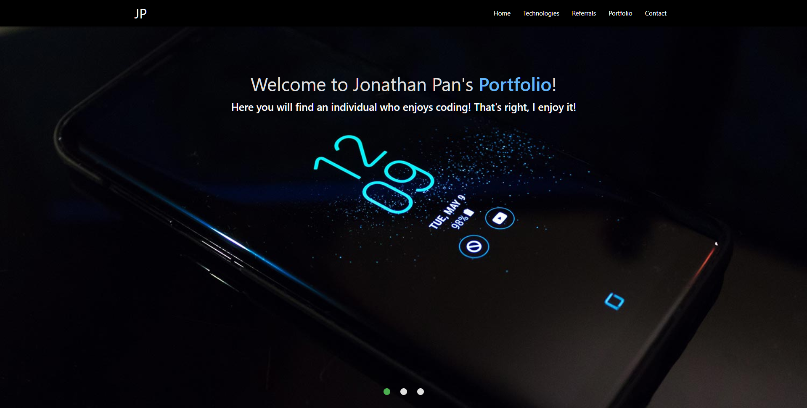

# Jonathan Pan's Portfolio

[Deployed Here](https://www.jonmpan.com)

Welcome to the github repo for my portfolio. You can copy this repo and use it for yourself if you so incline. Built with create-react-app and some boilerplate server/express code. Currently the backend serves my BixbyDex API. Styled with Materialize. Deployed on heroku. Testing.

### Personal To-do-list (Someday I might get to these)

- [x] Make a readme file
- [ ] Make a good readme file
- [ ] Add commenting throughout the code
- [ ] Get better images or image(s) of myself for the fullscreen slider
- [ ] Add HTML5 canvas animation to the slider
- [ ] Make/get logo for JP
- [ ] Close Materialize mobile sidebar upon clicking on a link
- [ ] Add reddit scraper and clicky game to portfolio
- [ ] Consider adding CLI apps to portfolio which include talking twitter app
- [ ] Get more legit recommendations
- [ ] Convert individual recommendations into RecommendationCards components
- [ ] Make slider for recommendations
- [ ] Convert recommendations and portfolio objects to mongodb documents and query those upon mounting to render in react
- [ ] Implement linkedIn login system to submit recommendations
- [ ] Implement admin login system to allow for editing database, approving recommendations submitted, and to add portfolio pieces
- [ ] Add a chat room to chat with other logged in linkedIn users and myself! Why? Because I enjoy using socket.io.
